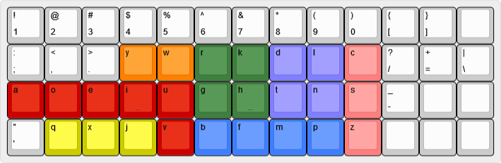
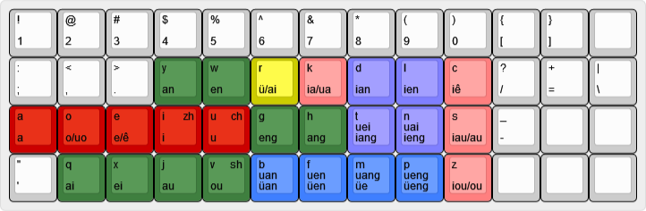
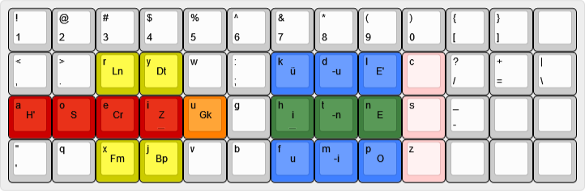

# The dƷvorak Keyboard Layout

<br>
<br>

dƷvorak is a keyboard layout designed for comfortable and efficient touch typing in chinese created by sulfurandcu in 2015, and released in 2021.

```
1   2   3   4   5   6   7   8   9   0   [   ]    
;   ,   .   y   w   r   k   d   l   c   /   =   \
a   o   e   i   u   g   h   t   n   s   -        
'   q   x   j   v   b   f   m   p   z            
```

<br>
<br>

### 键位布局



<br>
<br>

### 双拼方案



<br>
<br>

### 宫保方案



<br>
<br>
